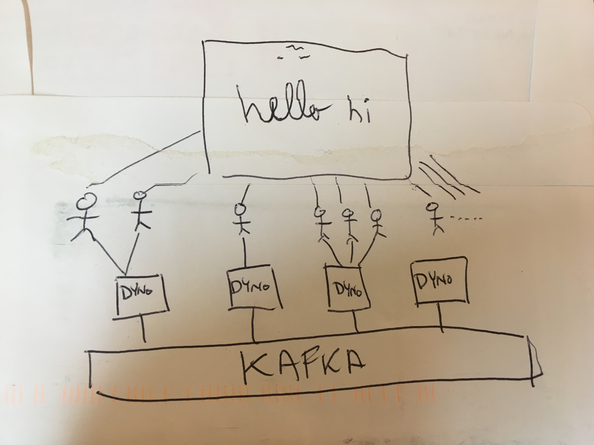

# kafka-whiteboard

Fun, sample app combining Node.js, Kafka, and Socket.io.  It's a shared, scalable virtual whiteboard that hundreds of people can draw on at the same time.



## Deploying to Heroku via CLI

Create a heroku app with Kafka attached. Note that the [`heroku-kafka:basic-0`](https://elements.heroku.com/addons/heroku-kafka#pricing) plan is **not** free.

```
$ heroku create
$ heroku addons:create heroku-kafka:basic-0
$ heroku kafka:wait
```

Create a topic:

```
$ heroku kafka:topics:create messages
```

NOTE: If you use a different topic name, you will need to set an env var:
```
$ heroku kafka:topics:create my-topic-name
$ heroku config:set KAFKA_TOPIC=my-topic-name
```

Deploy to Heroku and open the app:

```
$ git push heroku master
$ heroku open
```

## Scaling

Socket.io requires sticky sessions in order to be scaled up.
On Heroku, you can enable that with:

```
$ heroku features:enable http-session-affinity
```

Then scale to as many dynos as you want. Messages will be synchronized across dynos using Apache Kafka on Heroku.

```
$ heroku scale web=4:standard-1x
```

## Developing locally

We'll use our Apache Kafka on Heroku cluster, so the add-on must have been provisioned already.

```
yarn
heroku config --json > .env
heroku local -f Procfile.dev
```
Be sure you don't add secret information in `.env` to source control
```
if [ ! -f ".gitignore" ]; then echo ".env" > .gitignore; else echo ".env" >> .gitignore; fi
```

Get detailed debug information:

```
DEBUG=* heroku local -f Procfile.dev
```
